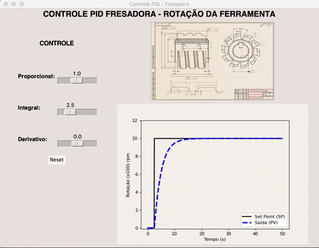
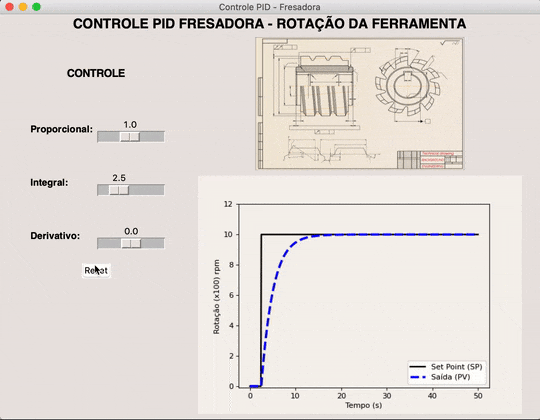

# Milling Machine PID System

## Objective
Simulate a PID system for a milling machine with real time graph plotting in order to evaluate the impact of these adjustments on its RPM curve at its starting.

The application was written entirely using Python, making use of the Tkinter library for the GUI and Matplotlib for the plotting.

## Features
The PID parameters are available to be changed in the GUI (at a certain range) acting directly to the given mathematical equation that describes the machine operation coded into the software. The corresponding graph is then presented considering these changes made by the user.

Proportional Control:

Integral Control:

Derivative Control:

